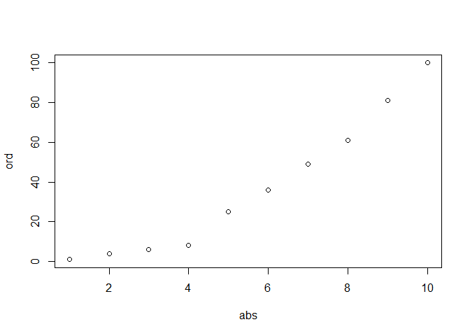
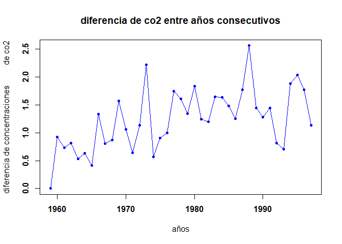
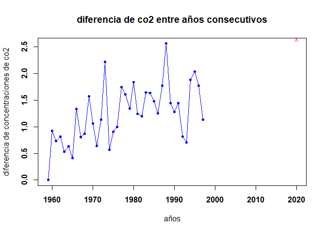

tarea 1
================
Grupo 12
18/11/2021

# Tarea de Programación 1

## PARTE 1

### 1.Calcula los valores numéricos aproximados de

#### Descripción:

a.Usamos los operadores matemáticos \* para multiplicar y / para dividir
los decimales. OJO. Si no le colocas los paréntesis no da el resultado
correcto.

b.Usamos “factorial()” para operar y también para “e” usamos exp y en el
paréntesis colocamos el número por el que se quiere elevar.

c.Usamos “factorial()” para operar, asimismo usamos los operadores
matemáticos de la multiplicación, división y potenciación.

d.Para realizar una combinatoria también se puede usar “choose ()”

#### a.

``` r
(0.3 * 0.15) / (0.3 * 0.15 + 0.2 * 0.8 + 0.5 * 0.12)
```

    ## [1] 0.1698113

#### b.

``` r
((5 ^ 6 )/(factorial(6)) ) *exp(-5)
```

    ## [1] 0.1462228

#### c. 

``` r
(factorial(20)/(factorial(13)*factorial(7)))*0.4^7*0.6^13 
```

    ## [1] 0.1658823

### 2. Realizar la siguiente suma

#### Descripción:

a.Usamos el código “seq” para hacer la secuencia del 1 al 1000 y el
código “sum” para sumar la secuencia.

b.Usamos el código “seq” en función a (2^) que va del 1 al 10, además,
el código “sum” para sumar y le sumamos 1.

#### a.

``` r
sum(seq(1:1000))
```

    ## [1] 500500

#### b.

``` r
1+sum(2^seq(1:10))
```

    ## [1] 2047

### 3. El vector grupo representa el grupo al que pertenece una serie de alumnos

#### Descripción:

a.Usamos el código “length” para contar el número de elementos.

b.Usamos el código“ which” para señalar las posiciones en las que se
encuentra A respecto del vector “grupo”

#### a. ¿Cuántos elementos tiene?

``` r
load(url("https://goo.gl/uDzU8v"))
length(grupo)
```

    ## [1] 192

#### b. En qué posiciones del vector está la letra “A’’?

``` r
load(url("https://goo.gl/uDzU8v"))
which(grupo=="A")
```

    ##  [1]   2   8  17  21  28  84 101 108 111 115 123 136 190 192

### 04. El vector nota representa la nota de un examen de los alumnos que están en los grupos del vector grupo.

#### Descripción:

a.Usamos el código “sum” para sumar las notas del vector “nota”

b.Usamos el código “mean” para sacar la media aritmética de el vector
“nota”

c.Usamos el código “which” para saber las posiciones de las notas
mayores de 7

d.Creamos un vector “notordenadas” donde utilizamos el código “order”,
en sus paréntesis ponemos “na.last=TRUE” y “decreasing=TRUE” para tener
las notas ordenadas decrecientemente.

e.Usamos el código “matcha” para hallar la posición y en sus paréntesis
agregamos el “max” para la mayor de las notas, además, “,notas” y
cerramos paréntesis.

#### a.¿Cuánto suman todas las notas?

``` r
load(url("https://goo.gl/uDzU8v"))
sum(nota)
```

    ## [1] 962

#### b.¿Cuál es la media aritmética de todas las notas?

``` r
load(url("https://goo.gl/uDzU8v"))
mean(nota)
```

    ## [1] 5.010417

#### c.¿En qué posiciones están las notas mayores de 7.0?

``` r
load(url("https://goo.gl/uDzU8v"))
which(nota>7)
```

    ## [1]  81 103 120 151

#### d. Visualiza las notas ordenadas de mayor a menor

``` r
load(url("https://goo.gl/uDzU8v"))
notordenadas<-order(nota,na.last=TRUE,decreasing=TRUE)
nota[notordenadas]
```

    ##   [1] 7.7 7.5 7.4 7.2 7.0 6.9 6.9 6.8 6.8 6.8 6.8 6.8 6.6 6.5 6.4 6.4 6.4 6.4
    ##  [19] 6.3 6.2 6.2 6.2 6.2 6.2 6.2 6.1 6.1 6.1 6.1 6.0 6.0 6.0 6.0 6.0 6.0 5.9
    ##  [37] 5.9 5.9 5.9 5.9 5.9 5.9 5.9 5.9 5.8 5.8 5.8 5.8 5.8 5.7 5.7 5.7 5.7 5.7
    ##  [55] 5.6 5.6 5.6 5.6 5.6 5.6 5.5 5.5 5.5 5.5 5.5 5.5 5.5 5.5 5.5 5.5 5.5 5.5
    ##  [73] 5.5 5.4 5.4 5.4 5.4 5.4 5.4 5.4 5.4 5.3 5.3 5.3 5.3 5.2 5.2 5.2 5.2 5.2
    ##  [91] 5.2 5.2 5.1 5.0 5.0 5.0 5.0 5.0 5.0 5.0 5.0 5.0 4.9 4.9 4.9 4.9 4.9 4.9
    ## [109] 4.8 4.8 4.8 4.8 4.8 4.8 4.7 4.7 4.7 4.7 4.7 4.7 4.7 4.7 4.7 4.7 4.6 4.6
    ## [127] 4.6 4.6 4.5 4.5 4.5 4.5 4.5 4.5 4.4 4.4 4.4 4.4 4.4 4.4 4.4 4.3 4.3 4.3
    ## [145] 4.2 4.2 4.2 4.2 4.2 4.2 4.2 4.2 4.1 4.1 4.1 4.1 4.1 4.0 4.0 4.0 4.0 4.0
    ## [163] 4.0 3.9 3.9 3.8 3.8 3.8 3.7 3.7 3.7 3.7 3.6 3.6 3.6 3.5 3.4 3.4 3.4 3.4
    ## [181] 3.2 3.2 3.2 3.1 3.0 2.9 2.9 2.9 2.7 2.6 2.5 1.7

#### e.¿En qué posición está la nota máxima?

``` r
load(url("https://goo.gl/uDzU8v"))
match(max(nota),nota)
```

    ## [1] 120

### 05. A partir de los vectores grupo y nota definidos.

#### Descripción:

Creamos un vector llamado “colegio” el cual va estar determinado por el
código “data’’. frame” el cual agrupará los vectores grupo y nota.

Usamos el código “sum” donde colocamos el vector “nota” que va estar en
función del 1 al 10. a.Usamos “length” , abrimos paréntesis y colocamos
el vector “nota” el cual va estar señalado por “grupo == ´C´.

b.Usamos el código “length” donde colocamos el vector “nota”, dentro de
este señalaremos que “nota” debe ser mayor a 5.

c.Usamos el código “length” donde el vector “nota” va estar indicado por
el grupo B de los que tiene una nota mayor a 5.

d.Primero : Crearemos el vector “AprobC” el que va ser definido por el
código “length” del vector “nota” del grupo C que tiene una nota mayor a
5. Segundo: Crearemos otro vector el cual se llamará “TodoC” y estará
definido por el código “length” del vector “nota” del grupo C. Tercero:
Dividimos “AprobC” por “TodoC” y multiplicamos por 100 para obtener el
porcentaje solicitado.

e.Usamos los códigos “max” y “min” para saber cuales son los máximos y
mínimos del vector nota. Del vector “colegio” abrimos corchetes e
indicamos que del “colegio” necesitamos solamente el vector “nota” por
lo que usamos “$”, colocamos “==” señalando la máxima nota del vector
“nota” , colocamos una coma y cerramos corchete. Realizamos lo mismo
para el mínimo. Usaremos el código “mean”, donde el vector nota va estar
indicado por, ya sea por a ‘A’ o ‘B’ y señalaremos que este debe ser
mayor a 5 usando el “&”. Para el mean de ‘A’ y ‘B’ juntos usaremos el
mismo código “mean” pero del el vector c con el vector “nota” señalando
que ’A´ debe ser mayor a 5, colocamos una coma y repetimos el para el
´B´.

``` r
load(url("https://goo.gl/uDzU8v"))
colegio=data.frame(grupo=c(grupo),nota=c(nota))
```

#### a. Suma de notas 10 primeros alumnos

``` r
load(url("https://goo.gl/uDzU8v"))
sum(nota[1:10])
```

    ## [1] 51.8

#### b. ¿Cuántos alumnos hay en el grupo C?

``` r
load(url("https://goo.gl/uDzU8v"))
length(nota[grupo=='C'])
```

    ## [1] 39

#### c. ¿Cuántos alumnos han aprobado?

``` r
load(url("https://goo.gl/uDzU8v"))
 length(grupo[nota>5])
```

    ## [1] 93

#### d. ¿Cuántos alumnos del grupo B han aprobado?

``` r
load(url("https://goo.gl/uDzU8v"))
length(nota[grupo=='B'&nota>5])
```

    ## [1] 10

#### e. ¿Porcentaje de alumnos del grupo C han aprobado?

``` r
load(url("https://goo.gl/uDzU8v"))
AprobC=c(length(nota[grupo=='C'&nota>5]))
TodoC=length(nota[grupo=='C'])
(AprobC/TodoC)*100
```

    ## [1] 56.41026

#### f. ¿De qué grupos son la máxima y mínima nota de toda la muestra?

``` r
load(url("https://goo.gl/uDzU8v"))
max(nota)
```

    ## [1] 7.7

``` r
min(nota)
```

    ## [1] 1.7

``` r
colegio[colegio$nota==max(nota),]
```

    ##     grupo nota
    ## 120     E  7.7

``` r
colegio[colegio$nota==min(nota),]
```

    ##     grupo nota
    ## 142     B  1.7

#### g. Nota media de los alumnos de grupo A y B, juntos, considerando sólo a los que han aprobado

``` r
load(url("https://goo.gl/uDzU8v"))
mean(nota[grupo=='B'&nota>5])
```

    ## [1] 6.15

``` r
mean(nota[grupo=='A'&nota>5])
```

    ## [1] 5.425

``` r
mean(c(nota[grupo=='B'&nota>5],nota[grupo=='A'&nota>5]))
```

    ## [1] 5.942857

### 06. Calcula el percentil 66 de las notas de todos los alumnos, y también de los alumnos del grupo C

#### Descripción:

a.Usamos “quantile” y agregamos el vector “notas” para sacar el
percentil de 66 alumnos que se escribe (66/100)

b.Creamos un vector “alumnos.data” donde se tendrá agrupado dos vectores
los cuales son (grupo, notas) en un “data.frame” , luego creamos un
vector “soloC” separaremos las notas de los alumnos del grupo cC con el
código “alumnos.data\[(alumnos.data$grupo == ”C”),\]” y por último,
usamos “quantile(soloC$nota, 66/100)” para hallar el percentil de los
alumnos del grupo C.

### Todos los alumnos

``` r
load(url("https://goo.gl/uDzU8v"))
quantile(nota, 66/100)
```

    ## 66% 
    ## 5.5

``` r
nota[nota<=5.5]
```

    ##   [1] 4.9 5.4 5.2 5.0 4.4 4.1 4.3 5.5 5.5 4.8 5.5 4.7 5.2 4.8 3.4 4.7 5.4 5.3
    ##  [19] 4.2 4.4 4.8 5.2 4.6 5.0 2.5 4.0 4.9 5.4 3.9 4.2 4.7 4.2 5.4 3.7 3.7 2.7
    ##  [37] 5.0 2.6 5.0 4.9 3.4 4.3 4.5 5.5 3.2 3.2 4.4 5.0 5.4 3.8 4.2 4.7 4.7 5.3
    ##  [55] 4.0 4.8 4.1 4.5 2.9 5.0 4.6 4.9 4.2 4.4 4.2 4.5 4.3 3.7 3.9 5.2 4.9 3.6
    ##  [73] 5.5 5.0 4.1 4.5 3.1 5.4 4.5 5.3 4.7 5.2 5.3 5.0 4.0 5.2 4.0 5.5 4.0 5.4
    ##  [91] 4.6 3.4 3.8 4.8 4.0 4.4 5.5 4.9 1.7 5.5 5.5 3.8 5.5 3.5 5.5 3.4 4.7 3.6
    ## [109] 4.1 5.0 4.6 3.6 4.7 4.1 4.7 3.2 5.5 3.0 4.5 5.5 4.4 3.7 4.4 4.7 4.2 5.2
    ## [127] 5.1 2.9 4.2 5.4 4.8 2.9

``` r
nota[nota>5.5]
```

    ##  [1] 6.8 6.2 6.4 6.8 6.4 6.0 5.9 5.6 6.9 5.6 5.8 6.1 6.2 6.6 5.6 6.2 5.9 5.8 5.6
    ## [20] 5.9 6.1 6.4 6.0 7.0 6.8 7.2 6.0 5.8 6.8 6.9 5.7 5.7 6.4 5.8 7.4 6.0 6.1 7.7
    ## [39] 6.2 5.7 5.9 5.9 5.7 5.9 6.0 7.5 5.8 5.7 5.9 5.9 5.6 6.0 6.8 6.1 6.2 6.5 5.9
    ## [58] 6.2 6.3 5.6

#### Alumnos del grupo C

``` r
load(url("https://goo.gl/uDzU8v"))
alumnos.data <- data.frame(grupo,nota) 
soloC <- alumnos.data[(alumnos.data$grupo == "C"),]
quantile(soloC$nota, 66/100)
```

    ##   66% 
    ## 5.808

### 07. Un alumno tiene una nota de 4.9. ¿Qué porcentaje, del total de alumnos, tiene una nota menor o igual que la suya? ¿Y qué porcentaje tiene una nota mayor o igual que la suya?

#### Descripción:

a.Creamos un vector “M” y en el utilizamos “length(nota\[nota>=4.9\])”
para contar la cantidad de alumnos menor o igual a 4.9, luego, hallamos
el total de alumnos con “length” y lo ponemos el vector TOTAL, y por
último dividimos los vectores A entre TOTAL y multiplicamos por 100 para
sacar el porcentaje pedido.

b.Creamos un vector “N” y en el utilizamos “length(nota\[nota\<=4.9\])”
para contar la cantidad de alumnos mayor o igual a 4.9, luego, hallamos
el total de alumnos con “length” y lo ponemos el vector TOTAL, y por
último dividimos los vectores M entre TOTAL y multiplicamos por 100 para
sacar el porcentaje pedido.

``` r
load(url("https://goo.gl/uDzU8v"))
M=length(nota[nota>=4.9])
N=length(nota[nota<=4.9])
TOTAL=length(nota)
(M/TOTAL)*100
```

    ## [1] 56.25

``` r
(N/TOTAL)*100
```

    ## [1] 46.875

### 08.Realiza el gráfico de diagramas de caja de las notas de cada grupo, para poder comparar el nivel de cada uno de ellos.

#### Descripción:

Para realizar un gráfico de diagrama de caja se debe usar el código
“boxplot” y entre paréntesis primero el vector “nota” seguido por un
“\~” y finalmente “grupo”

``` r
load(url("https://goo.gl/uDzU8v"))
boxplot(nota~grupo)
```

<!-- -->

### 09. Si la variable conc recoge la concentración de plomo (en ppm) en el aire de cierta zona durante un día completo.

#### Descripción:

1.Creamos un vector llamado “horas” 2.Creamos un vector llamado “Pb” en
donde se va realizar un “data.frame” de la conc y las horas. a.Usamos el
código “max” donde colocamos la conc del vector “Pb”

b.Usamos el código “length” en la que empleamos “which” al vector “Pb” y
añadimos “$” para especificar que se desea la concentración y finalmente
añadimos “\>40”.

c.Usamos el código “mean” para obtener la media de la concentración del
plomo.

d.Usamos el código “order” en la cual indicamos la concentración del
vector Pb, empleamos el código “na. last” el cual es verdadero y
añadimos el código “decreasing” que también es verdadero. Por último,
usamos el código “tail” donde especificamos que queremos a las
concentraciones menores a 10 del vector Pb.

e.Escribimos “Pb$horas”,especificando este último por que se desea saber
las hora del día en el que se alcanzó la hora máxima. Después usamos el
código “match” en donde colocamos “max” de la concentración del plomo
del vector llamado “Pb”.

``` r
load(url("https://goo.gl/uDzU8v"))
horas<-c(0,seq(1:23))
Pb<-data.frame(conc, horas)
Pb
```

    ##      conc horas
    ## 1    4.76     0
    ## 2    4.60     1
    ## 3    6.14     2
    ## 4    2.96     3
    ## 5    3.15     4
    ## 6    1.77     5
    ## 7    4.36     6
    ## 8    4.00     7
    ## 9    2.03     8
    ## 10   6.13     9
    ## 11   2.88    10
    ## 12   6.15    11
    ## 13   3.05    12
    ## 14   3.37    13
    ## 15   5.21    14
    ## 16   3.10    15
    ## 17   3.57    16
    ## 18   7.11    17
    ## 19   7.32    18
    ## 20   2.75    19
    ## 21   6.96    20
    ## 22   7.66    21
    ## 23   3.54    22
    ## 24   6.48    23
    ## 25   6.19     0
    ## 26   7.77     1
    ## 27   8.96     2
    ## 28   6.94     3
    ## 29   5.70     4
    ## 30   7.14     5
    ## 31   8.38     6
    ## 32   5.69     7
    ## 33   7.24     8
    ## 34  10.57     9
    ## 35   9.99    10
    ## 36   9.83    11
    ## 37   9.06    12
    ## 38  11.28    13
    ## 39   7.07    14
    ## 40  11.09    15
    ## 41  11.20    16
    ## 42  10.73    17
    ## 43  12.24    18
    ## 44  13.14    19
    ## 45  14.69    20
    ## 46  12.48    21
    ## 47  12.91    22
    ## 48  12.48    23
    ## 49  14.10     0
    ## 50  13.87     1
    ## 51  14.98     2
    ## 52  15.46     3
    ## 53  17.67     4
    ## 54  14.78     5
    ## 55  17.51     6
    ## 56  14.10     7
    ## 57  16.60     8
    ## 58  19.75     9
    ## 59  14.86    10
    ## 60  20.63    11
    ## 61  18.37    12
    ## 62  19.81    13
    ## 63  19.40    14
    ## 64  19.48    15
    ## 65  19.36    16
    ## 66  21.91    17
    ## 67  22.70    18
    ## 68  24.81    19
    ## 69  23.74    20
    ## 70  21.98    21
    ## 71  22.40    22
    ## 72  24.28    23
    ## 73  25.27     0
    ## 74  25.67     1
    ## 75  23.74     2
    ## 76  24.33     3
    ## 77  24.51     4
    ## 78  26.65     5
    ## 79  25.65     6
    ## 80  27.74     7
    ## 81  29.32     8
    ## 82  29.05     9
    ## 83  31.06    10
    ## 84  28.73    11
    ## 85  30.97    12
    ## 86  31.36    13
    ## 87  28.61    14
    ## 88  30.50    15
    ## 89  31.72    16
    ## 90  30.93    17
    ## 91  32.61    18
    ## 92  32.76    19
    ## 93  31.24    20
    ## 94  34.54    21
    ## 95  32.11    22
    ## 96  34.23    23
    ## 97  35.08     0
    ## 98  36.34     1
    ## 99  32.54     2
    ## 100 35.51     3
    ## 101 36.19     4
    ## 102 35.97     5
    ## 103 37.79     6
    ## 104 36.69     7
    ## 105 38.18     8
    ## 106 36.11     9
    ## 107 38.08    10
    ## 108 39.05    11
    ## 109 38.11    12
    ## 110 37.86    13
    ## 111 40.08    14
    ## 112 39.36    15
    ## 113 42.05    16
    ## 114 39.43    17
    ## 115 37.80    18
    ## 116 39.10    19
    ## 117 40.99    20
    ## 118 41.34    21
    ## 119 38.66    22
    ## 120 41.48    23
    ## 121 43.77     0
    ## 122 42.70     1
    ## 123 42.42     2
    ## 124 42.30     3
    ## 125 43.72     4
    ## 126 40.57     5
    ## 127 40.49     6
    ## 128 41.81     7
    ## 129 43.84     8
    ## 130 45.71     9
    ## 131 42.26    10
    ## 132 45.00    11
    ## 133 42.76    12
    ## 134 45.97    13
    ## 135 44.04    14
    ## 136 43.17    15
    ## 137 42.56    16
    ## 138 43.11    17
    ## 139 42.46    18
    ## 140 42.29    19
    ## 141 44.80    20
    ## 142 47.34    21
    ## 143 45.32    22
    ## 144 44.49    23
    ## 145 45.57     0
    ## 146 46.70     1
    ## 147 43.86     2
    ## 148 45.39     3
    ## 149 43.38     4
    ## 150 43.02     5
    ## 151 43.66     6
    ## 152 44.64     7
    ## 153 45.57     8
    ## 154 43.71     9
    ## 155 42.77    10
    ## 156 43.88    11
    ## 157 43.18    12
    ## 158 41.67    13
    ## 159 45.37    14
    ## 160 40.52    15
    ## 161 42.98    16
    ## 162 44.91    17
    ## 163 41.52    18
    ## 164 40.12    19
    ## 165 41.97    20
    ## 166 42.36    21
    ## 167 42.52    22
    ## 168 40.95    23
    ## 169 39.12     0
    ## 170 42.23     1
    ## 171 41.90     2
    ## 172 41.73     3
    ## 173 42.19     4
    ## 174 41.10     5
    ## 175 40.45     6
    ## 176 38.89     7
    ## 177 37.95     8
    ## 178 42.06     9
    ## 179 37.97    10
    ## 180 40.29    11
    ## 181 36.50    12
    ## 182 38.18    13
    ## 183 37.34    14
    ## 184 38.67    15
    ## 185 39.15    16
    ## 186 39.54    17
    ## 187 38.12    18
    ## 188 37.59    19
    ## 189 33.63    20
    ## 190 36.01    21
    ## 191 33.46    22
    ## 192 32.70    23
    ## 193 35.48     0
    ## 194 35.19     1
    ## 195 34.83     2
    ## 196 32.79     3
    ## 197 30.55     4
    ## 198 34.24     5
    ## 199 31.56     6
    ## 200 27.99     7
    ## 201 30.63     8
    ## 202 32.71     9
    ## 203 28.28    10
    ## 204 30.03    11
    ## 205 32.46    12
    ## 206 27.45    13
    ## 207 28.88    14
    ## 208 25.21    15
    ## 209 27.86    16
    ## 210 25.62    17
    ## 211 24.71    18
    ## 212 25.06    19
    ## 213 27.52    20
    ## 214 24.32    21
    ## 215 25.57    22
    ## 216 24.59    23
    ## 217 25.97     0
    ## 218 22.82     1
    ## 219 24.84     2
    ## 220 20.93     3
    ## 221 23.93     4
    ## 222 22.78     5
    ## 223 20.20     6
    ## 224 22.85     7
    ## 225 21.81     8
    ## 226 17.71     9
    ## 227 18.03    10
    ## 228 18.05    11
    ## 229 18.95    12
    ## 230 17.31    13
    ## 231 15.58    14
    ## 232 16.22    15
    ## 233 15.83    16
    ## 234 18.48    17
    ## 235 16.81    18
    ## 236 19.00    19
    ## 237 17.37    20
    ## 238 20.37    21
    ## 239 16.53    22
    ## 240 14.03    23
    ## 241 15.51     0
    ## 242 11.71     1
    ## 243 11.72     2
    ## 244 10.65     3
    ## 245 15.09     4
    ## 246 12.64     5
    ## 247 12.56     6
    ## 248 11.65     7
    ## 249  8.68     8
    ## 250 10.61     9
    ## 251 10.54    10
    ## 252  6.88    11
    ## 253  8.85    12
    ## 254  6.92    13
    ## 255 11.67    14
    ## 256 10.31    15
    ## 257  9.51    16
    ## 258  8.27    17
    ## 259  9.42    18
    ## 260  9.28    19
    ## 261  8.67    20
    ## 262  6.48    21
    ## 263  6.14    22
    ## 264  5.48    23
    ## 265  4.14     0
    ## 266  5.50     1
    ## 267  9.17     2
    ## 268  3.86     3
    ## 269  3.80     4
    ## 270  5.66     5
    ## 271  2.73     6
    ## 272  7.80     7
    ## 273  3.75     8
    ## 274  5.96     9
    ## 275  3.75    10
    ## 276  6.88    11
    ## 277  5.79    12
    ## 278  2.91    13
    ## 279  2.88    14
    ## 280  2.58    15
    ## 281  3.11    16
    ## 282  0.93    17
    ## 283  1.07    18
    ## 284  3.46    19
    ## 285  3.87    20
    ## 286  5.48    21
    ## 287  3.67    22
    ## 288  3.55    23

#### a. ¿Cuál ha sido la concentración máxima?

``` r
load(url("https://goo.gl/uDzU8v"))
max(Pb$conc)
```

    ## [1] 47.34

#### b. ¿En cuántos de los muestreos se ha superado la concentración de 40.0 ppm?}

``` r
length(which(Pb$conc>40))
```

    ## [1] 61

#### c. ¿Cuál ha sido la concentración media del día?

``` r
mean(Pb$conc)
```

    ## [1] 24.07229

#### d. ¿Cuáles fueron las 10 mediciones más bajas del día?

``` r
menconc=order(Pb$conc,na.last = TRUE,decreasing = TRUE)
Pb$conc[tail(menconc, 10)]
```

    ##  [1] 2.91 2.88 2.88 2.75 2.73 2.58 2.03 1.77 1.07 0.93

#### e. Si la primera medida fue a las 00:00. ¿A qué hora del día se alcanzó la concentración máxima?

``` r
Pb$horas[match(max(Pb$conc),Pb$conc)]
```

    ## [1] 21

## PARTE 2

### 1.Graficar los puntos (1,1),(2,4),(3,6),(4,8),(5,25),(6,36),(7,49),(8,61),(9,81),(10,100) en un plano usado Rstudio.

#### Descripción:

a.Escribimos que el vector llamado “abscisas” tiene como valores a 1, 2,
3, 4, 5, 6, 7, 8, 9, 10

b.Escribimos que el vector llamado “ordenadas” tiene como valores a 1,
4, 6, 8, 25, 36, 49, 61, 81, 100

c.Usamos el código “plot” señalado que “x=abscisas” y “y = ordenadas”

``` r
load(url("https://goo.gl/uDzU8v"))
abs<-c(1,2,3,4,5,6,7,8,9,10)
ord<-c(1,4,6,8,25,36,49,61,81,100)
plot(x=abs,y=ord)
```

<!-- -->
### 2. Ingresar la matriz A en RStudio #### Descripción: Escribimos los
valores del vector llamado “vect_matriz1” acorde al orden indicado en
las columnas de la matriz de ejemplo.Usamos el código “matrix” en donde
la data es “vect_matriz1”, el número de filas es 4 y el número de
columnas es 3. Finalmente nombramos a nuestra matriz como A.

``` r
vect_matriz1<-c(1, 2, 3, 4, 2, 4, 6, 8, 3, 6, 9, 12)
matrix(data = vect_matriz1, nrow = 4, ncol = 3)
```

    ##      [,1] [,2] [,3]
    ## [1,]    1    2    3
    ## [2,]    2    4    6
    ## [3,]    3    6    9
    ## [4,]    4    8   12

``` r
A= matrix(data = vect_matriz1, nrow = 4, ncol = 3)
```

### 3. Ingresar la matriz identidad de tamaño 3

#### Descripción:

Como es una matriz de identidad debe cumplir que el número 1 debe
coincidir en la diagonal de la matriz de 3x3. Para ello usamos el código
“diag” y entre los paréntesis colocamos el tamaño de la matriz.

``` r
diag(3)
```

    ##      [,1] [,2] [,3]
    ## [1,]    1    0    0
    ## [2,]    0    1    0
    ## [3,]    0    0    1

### 4.Crea una función que cree una matriz nula ingresando las dimensiones

#### Descripción:

Creamos el vector “mnula” en donde usamos el código “function” en “x” y
“y” la cual colocamos la función matrix(0,x,y)

``` r
mnula<-function(x,y) {
matrix(0,x,y)
}
```

### 5. Modificar la matriz diag(4), para que se parezca a la matriz B

#### Descripción:

Creamos un vector “mt” con los numerales (0,2,3,4), luego usamos “diag”
y entre paréntesis ponemos en x ponemos el vector v3 y en filas y
columnas ponemos 4 (nrow=ncol=4).

``` r
mt<-c(0, 2, 3, 4)
B=diag(x =mt, nrow = 4, ncol = 4)
```

### 6. Obtener la matriz transpuesta de A (ejercicio 2)

#### Descripción:

Con el código “t” y agregando el vector A conseguimos la matriz
transpuesta

``` r
t(A)
```

    ##      [,1] [,2] [,3] [,4]
    ## [1,]    1    2    3    4
    ## [2,]    2    4    6    8
    ## [3,]    3    6    9   12

### 7. Realizar las siguientes operaciones A+B, A - B, 3B y AB

#### Descripción:

Usamos operadores matemáticos para los 4 casos: en el primero A + B; en
el segundo, A - B; para el tercero multiplicamos *3 y, finalmente,
multiplicamos ambas matrices, en este caso el operador matemático se
representa como “ %*% “

#### A + B

La matriz A y B no poseen el mismo número de columnas por lo que la
matriz no está definida.

#### A - B

La matriz A y B no poseen el mismo número de columnas por lo que la
matriz no está definida.

#### 3B

``` r
3 * B
```

    ##      [,1] [,2] [,3] [,4]
    ## [1,]    0    0    0    0
    ## [2,]    0    6    0    0
    ## [3,]    0    0    9    0
    ## [4,]    0    0    0   12

#### AB

La matriz A tiene 3 columnas y la matriz B, 4 filas por lo que no es
posible resolver.

### 8. Crea una función para calcula P6

#### Descripción:

Creamos un vector llamado “mat” el cual tiene como valores a
1,-2,1,2,4,0,3,-2,1. Luego creamos un vector “p” que tiene una matriz la
cual su data es “mat” y su número de filas y columna es de 3. Después
creamos el vector “fun” y usamos el código “function” en x el cual el
valor x se debe multiplicar 6 veces por x. Finalmente creamos la función
fun en p.

``` r
mat<-c(1,-2,1,2,4,0,3,-2,1)
p<-matrix(mat,nrow=3,ncol=3)
fun<- function(x){
(((((x%*%x)%*%x)%*%x)%*%x)%*%x)
}
fun(p)
```

    ##       [,1]  [,2]  [,3]
    ## [1,] -1792    24 -2824
    ## [2,]  -464 -2416 -1344
    ## [3,]  -648   440  -912

### 9. Resolver el sistema de ecuaciones

#### Descripción:

En un vector A usamos “cbind” y dentro ponemos con una “c” los
coeficientes de la x, lo mismo con los coeficientes de la y, z y del
término independiente pero este con un vector nuevo. Posteriormente
utilizamos “solve”(A,B) y se genera la respuesta.

``` r
A=cbind(c(3,9,3),c(-1,-2,1),c(1,1,-2))
B=c(-1,-9,-9)
solve(A,B)
```

    ## [1] -1  2  4

### 10. eigen sirve para hallar por separado los valores y vectores propios de una matriz

#### Descripción:

Utilizando la ayuda de R, investigue para qué sirven las funciones
eigen() y det() det sirve para hallar por separado el módulo del
determinante de una matriz

``` r
mtrx=matrix(c(-2,2,-3,-1,1,3,2,0,-1),3,3)
det(mtrx)
```

    ## [1] 18

``` r
eigen(mtrx)
```

    ## eigen() decomposition
    ## $values
    ## [1] -1.740446+3.020873i -1.740446-3.020873i  1.480893+0.000000i
    ## 
    ## $vectors
    ##                       [,1]                  [,2]         [,3]
    ## [1,] -0.0151632-0.5764302i -0.0151632+0.5764302i 0.1743727+0i
    ## [2,] -0.2043517+0.1954207i -0.2043517-0.1954207i 0.7252039+0i
    ## [3,]  0.7665177+0.0000000i  0.7665177+0.0000000i 0.6660882+0i

### 11. calcular A⋅B-A(B^t), cambiando B⋅A-B(A^t)

``` r
v <- (1:10)
v2 <- v*2
v3 <- v*3
v4 <- v*4
v5 <- v*5
B <- matrix(c(v,v2,v3,v4,v5),10)
X <- c(0,1,0,0,1,1,0,1,1,0,0,1,0,0,1,1,0,1,0,1,0,1,0,1,0)
A <- matrix(X,5)
B%*%A - B%*%t(A)
```

    ##       [,1] [,2] [,3] [,4] [,5]
    ##  [1,]    1   -1    1    2   -2
    ##  [2,]    2   -2    2    4   -4
    ##  [3,]    3   -3    3    6   -6
    ##  [4,]    4   -4    4    8   -8
    ##  [5,]    5   -5    5   10  -10
    ##  [6,]    6   -6    6   12  -12
    ##  [7,]    7   -7    7   14  -14
    ##  [8,]    8   -8    8   16  -16
    ##  [9,]    9   -9    9   18  -18
    ## [10,]   10  -10   10   20  -20

### 12.Considere β = ( X t ⋅ X ) ^−1 ⋅ X^ t ⋅ Y

``` r
vx <- matrix(c(rep(1,5), 1, -1, 0:2), nrow = 5, byrow = F)
vy <- matrix(c(0,0,1,1,3), nrow = 5, byrow = F)
solve((t(vx)%*%vx)^-1)%*%t(vx)%*%vy
```

    ##           [,1]
    ## [1,] 19.615385
    ## [2,]  3.230769

### 13.

####. Datos:

``` r
load(url("https://goo.gl/uDzU8v"))
data(co2) 
means = aggregate(co2, FUN=mean)
year = as.vector(time(means))
co2 = as.vector(means)      
```

#### a.

``` r
load(url("https://goo.gl/uDzU8v"))
co2
```

    ##  [1] 315.8258 316.7475 317.4850 318.2975 318.8325 319.4625 319.8725 321.2100
    ##  [9] 322.0200 322.8900 324.4592 325.5175 326.1550 327.2933 329.5117 330.0792
    ## [17] 330.9858 331.9858 333.7300 335.3358 336.6808 338.5150 339.7608 340.9592
    ## [25] 342.6083 344.2467 345.7258 346.9750 348.7508 351.3133 352.7542 354.0367
    ## [33] 355.4783 356.2917 356.9958 358.8800 360.9142 362.6867 363.8175

``` r
year
```

    ##  [1] 1959 1960 1961 1962 1963 1964 1965 1966 1967 1968 1969 1970 1971 1972 1973
    ## [16] 1974 1975 1976 1977 1978 1979 1980 1981 1982 1983 1984 1985 1986 1987 1988
    ## [31] 1989 1990 1991 1992 1993 1994 1995 1996 1997

#### b.

``` r
load(url("https://goo.gl/uDzU8v"))
diff(co2)
```

    ##  [1] 0.9216667 0.7375000 0.8125000 0.5350000 0.6300000 0.4100000 1.3375000
    ##  [8] 0.8100000 0.8700000 1.5691667 1.0583333 0.6375000 1.1383333 2.2183333
    ## [15] 0.5675000 0.9066667 1.0000000 1.7441667 1.6058333 1.3450000 1.8341667
    ## [22] 1.2458333 1.1983333 1.6491667 1.6383333 1.4791667 1.2491667 1.7758333
    ## [29] 2.5625000 1.4408333 1.2825000 1.4416667 0.8133333 0.7041667 1.8841667
    ## [36] 2.0341667 1.7725000 1.1308333

``` r
c(0,diff(co2))
```

    ##  [1] 0.0000000 0.9216667 0.7375000 0.8125000 0.5350000 0.6300000 0.4100000
    ##  [8] 1.3375000 0.8100000 0.8700000 1.5691667 1.0583333 0.6375000 1.1383333
    ## [15] 2.2183333 0.5675000 0.9066667 1.0000000 1.7441667 1.6058333 1.3450000
    ## [22] 1.8341667 1.2458333 1.1983333 1.6491667 1.6383333 1.4791667 1.2491667
    ## [29] 1.7758333 2.5625000 1.4408333 1.2825000 1.4416667 0.8133333 0.7041667
    ## [36] 1.8841667 2.0341667 1.7725000 1.1308333

``` r
t = c(0,diff(co2))
t
```

    ##  [1] 0.0000000 0.9216667 0.7375000 0.8125000 0.5350000 0.6300000 0.4100000
    ##  [8] 1.3375000 0.8100000 0.8700000 1.5691667 1.0583333 0.6375000 1.1383333
    ## [15] 2.2183333 0.5675000 0.9066667 1.0000000 1.7441667 1.6058333 1.3450000
    ## [22] 1.8341667 1.2458333 1.1983333 1.6491667 1.6383333 1.4791667 1.2491667
    ## [29] 1.7758333 2.5625000 1.4408333 1.2825000 1.4416667 0.8133333 0.7041667
    ## [36] 1.8841667 2.0341667 1.7725000 1.1308333

#### c.

``` r
load(url("https://goo.gl/uDzU8v"))
plot(year,t, type = "o" , pch = 20, xlab = "años" , ylab = "diferencia de concentraciones          de co2" , main ="diferencia de co2 entre años consecutivos" , col = "blue" , font = 2)
```

<!-- -->

#### d.

``` r
load(url("https://goo.gl/uDzU8v"))
plot(year, t, xlim=c(1959, 2020), type = "o" , pch = 20 , xlab = "años", ylab ="diferencia de concentraciones de co2", main = "diferencia de co2 entre años consecutivos", col = "blue" , font = 2)
points(2020, 2.64 , pch = 4, col = "red")
```

<!-- -->

### 14.

Lee el archivo rainfall.csv como un data.frame. Calcula e imprime un
vector con los nombres de las estaciones donde al menos uno de los meses
tiene una precipitación superior a 180mm

#### a.

``` r
rainfall_data_frame <- read.csv("C:/Users/gabriel/Downloads/rainfall.csv")
rainfall_data_frame[(rainfall_data_frame$sep > 180),]
```

    ##  [1] num      altitude sep      oct      nov      dec      jan      feb     
    ##  [9] mar      apr      may      name     x_utm    y_utm   
    ## <0 rows> (or 0-length row.names)

``` r
precipitación180=rainfall_data_frame [(rainfall_data_frame $sep>180)|(rainfall_data_frame $oct>180)|(rainfall_data_frame $nov>180)|(rainfall_data_frame $dec>180)|(rainfall_data_frame $jan>180)|(rainfall_data_frame $feb>180)|(rainfall_data_frame $mar>180)|(rainfall_data_frame $apr>180)|(rainfall_data_frame $may>180),]
c((precipitación180$name))
```

    ## [1] "Golan Farm" "Eilon"      "Fasutta"    "Yehiam"     "Kfar Mahol"
    ## [6] "Meron"      "Horashim"

``` r
n_estacion=c((precipitación180$name))
n_estacion
```

    ## [1] "Golan Farm" "Eilon"      "Fasutta"    "Yehiam"     "Kfar Mahol"
    ## [6] "Meron"      "Horashim"
